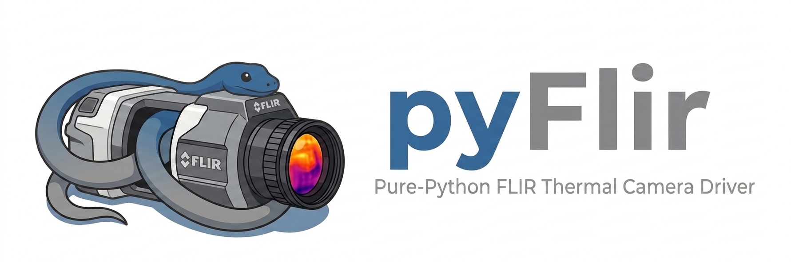

Pure-Python driver for FLIR® thermal cameras over GigE Vision. No vendor SDK
required; communicates directly via GVCP/GVSP protocols over UDP using
[pyGigEVision](https://github.com/ladisk/pyGigEVision) as the transport layer.

Supported cameras:

- FLIR Xsc-series (tested)
- FLIR A-series GigE Vision cameras (should work, untested)
- Other FLIR GigE Vision cameras (GenICam-compliant)

## Features

- **Auto-discovery** — finds cameras on the network regardless of IP
- **GenICam XML-driven** — downloads and parses the camera's feature descriptor;
  no hardcoded register maps for standard features
- **Live streaming** — real-time frame acquisition, `read(latest=True)` for lag-free display
- **ROI / subwindow** — configurable resolution for higher frame rates
- **Calibration blocks** — list and select temperature-range calibration presets
- **Radiometry** — emissivity, distance, atmospheric temperature, humidity
- **Temperature sensors** — read all on-board thermistors
- **NUC** — trigger non-uniformity correction, flag-in-FOV / stow
- **GUI viewer & CLI** — live thermal display, `pyflir discover / grab / live`
- **File I/O** — read FLIR ATS and SFMOV recorded files

## Installation

```bash
pip install pyFlir
```

For the GUI live viewer:

```bash
pip install pyFlir[gui]
```

## Quick start

```python
from pyflir import Camera

with Camera() as cam:
    cam.download_xml()                             # once; saves camera_<serial>.xml
    cam.load_xml("camera_xxx.xml")
    cam.frame_rate  = 30.0                         # Hz
    cam.exposure_ms = 8.0                          # ms

    frame = cam.grab()                             # single frame -> numpy (H, W), uint16
    frames = cam.acquire(10)                       # 10 frames -> list of (H, W)
```

Frames are returned as numpy arrays (uint16, H × W).

## Discovery

```python
from pyflir import discover

for cam in discover():
    print(cam["model"], cam["ip"], cam.get("serial", "?"))
```

## Connect

```python
from pyflir import Camera

with Camera() as cam:              # or Camera(ip="169.254.1.10")
    info = cam.info()
    print(info)
```

## Configure

```python
cam.frame_rate   = 30.0            # Hz
cam.exposure_ms  = 8.0             # milliseconds
cam.frame_rate_max                 # max Hz for current ROI (read-only)
cam.detector_temperature           # FPA temperature in °C (read-only)
```

## GenICam feature access

Features not exposed as properties are accessible by name:

```python
cam.read_int("Width")
cam.write_int("Height", 256)
cam.read_float("AcquisitionFrameRate")
cam.read_enum("PixelFormat")
cam.execute_command("AcquisitionStart")
```

## Calibration blocks (temperature range selection)

```python
for b in cam.get_calibration_blocks():
    print(b["index"], b.get("name"), b["tmin"], "–", b["tmax"], "°C")

cam.set_calibration_block(0)       # select first (coldest) range
cam.trigger_nuc()                  # trigger non-uniformity correction
```

## Radiometry

```python
cam.set_object_params(
    emissivity  = 0.95,
    distance_m  = 3.0,
    atm_temp_K  = 293.15,
    refl_temp_K = 293.15,
    humidity    = 0.50,
)
print(cam.get_object_params())
```

## ROI / subwindow

```python
cam.set_roi(128, 64)               # width × height; stop stream first
print(cam.get_roi())
print(cam.frame_rate_max)          # higher fps at smaller ROI
```

## Temperature sensors

```python
for name, celsius in cam.get_temperatures().items():
    print(f"{name}: {celsius:.1f} °C")
```

## NUC and flag

```python
cam.flag_move_in_fov()             # move flag in front of detector
cam.trigger_nuc()
cam.flag_move_stowed()             # stow flag, resume imaging
```

## Live streaming

```python
cam.start_stream()
try:
    while True:
        frame = cam.read(timeout=2.0, latest=True)   # latest=True prevents lag
        print(frame.mean())
finally:
    cam.stop_stream()
```

## Live viewer

```python
with Camera() as cam:
    cam.load_xml("camera_xxx.xml")
    cam.live_view()
```

Or from the command line:

```bash
pyflir live
```

## File I/O

```python
from pyflir import read_ats, read_sfmov

data, meta = read_ats("recording.ats")
frames, meta = read_sfmov("recording.sfmov")
```

## CLI

```bash
pyflir discover               # find cameras on the network
pyflir info                   # show camera configuration
pyflir grab -o frame.npy      # grab a single frame
pyflir live                   # open live viewer
pyflir setup                  # configure OS (firewall, MTU)
```

## Network setup

GigE Vision requires a firewall rule to allow inbound UDP from the camera.

**Linux:**

```bash
sudo sysctl -w net.core.rmem_max=16777216
sudo sysctl -w net.core.rmem_default=16777216
```

**Windows** (run once as admin):

```bash
netsh advfirewall firewall add rule name="pyFlir-GVSP" dir=in action=allow protocol=UDP program="C:\path\to\python.exe"
```

Or use the built-in helper:

```bash
pyflir setup
```

## Disclaimer

pyFlir is an independent, community-developed project. It is **not** affiliated
with, endorsed by, sponsored by, or supported by Teledyne FLIR, LLC in any way.

The name "pyFlir" is used solely to describe compatibility with cameras that
implement the GigE Vision standard and happen to be manufactured by Teledyne FLIR.
Register addresses and feature names were obtained from the GenICam XML descriptor
that the camera itself serves over the network, and from publicly available
documentation shipped with the hardware. No proprietary source code, SDK, or
trade secrets from Teledyne FLIR were used or reverse-engineered.

FLIR® is a registered trademark of Teledyne FLIR, LLC. All product and company
names are trademarks or registered trademarks of their respective owners and are
used here for identification purposes only.

## License

MIT
